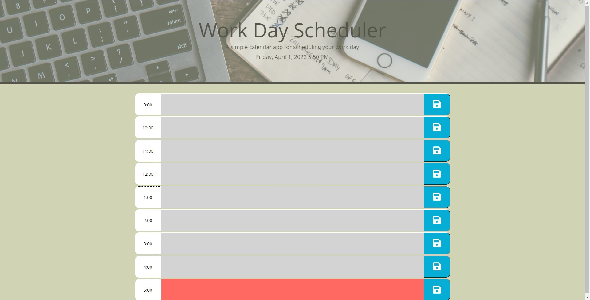

# Shop-Online

# Table of Contents

- [Description](#description)
- [Installation](#installation)
- [Usage](#usage)
- [Contributing](#contributing)
- [License](#license)
- [Questions](#github)

## Description

A simple calendar application that allows a user to save events for each business hour of the day.

This app will run in the browser and feature dynamically updated HTML and CSS powered by jQuery.

## Website

https://scottskinn.github.io/Work-Day-Scheduler/

## Installation

    Clone the repository from github, then from the terminal run *npm install* 

## Usage

Click on the text area to add your task for that hour. Then press the save button to the right.

Each time block is color-coded to indicate whether it is in the past(gray), present(red), or future(green).

## Contributing

    Feel free to make any suggestions on how to make this better.

## License

 

## Questions

[scottskinn](https://github.com/scottskinn/).

[scottskinn2n@gmail.com](mailto:scottskinn2n@gmail.com)
